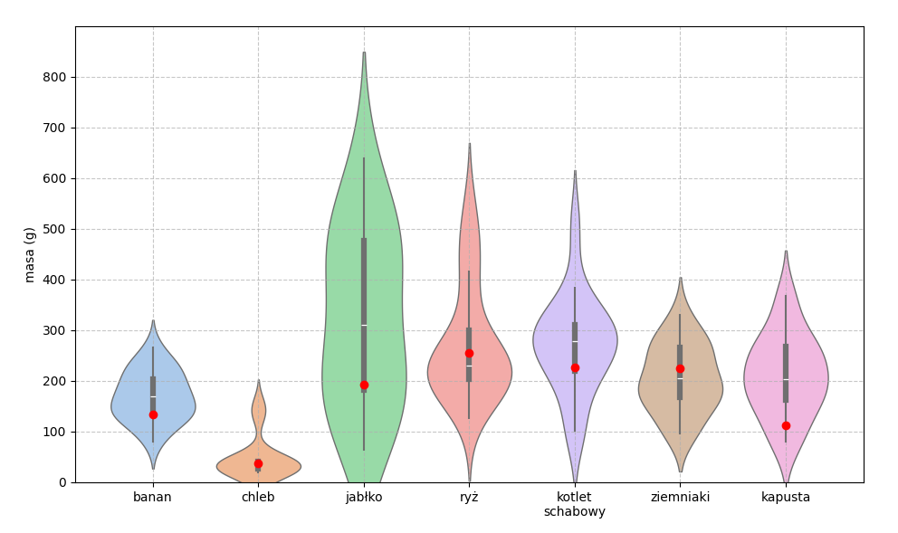

# Szacownie kaloryczności i wartości odżywczych na podstawie zdjęcia

Python 3.9.20\
CUDA 12.4

Modele oraz pliki konfiguracyjne do MMSegmentation dostępne do pobrania pod adresem: 
https://wutwaw-my.sharepoint.com/:f:/g/personal/01169586_pw_edu_pl/EglBj48NgihKkQ17LTeu20EBySQMi8b1F9q1veTthwbbBw?e=c8id67

| **Model** | **Bakcbone** | **mAcc** | **mIoU** | **czas treningu** |
|:---:|:---:|:---:|:---:|:---:|
| PSPNet | ResNet-50 | 46,50 | 33,25 | ~14 h | 
| DeepLabv3\+ | ResNet-50 | 44,45 | 32,08 | ~13,5 h |
| DeepLabv3\+ | ResNet-101 | 45,87 | 33,04 | ~17,5 h |
| UPerNet | Swin-tiny | 52,90 | 39,96 | ~15,5 h |
| UPerNet | Swin-base | 55,25 | 42,80 | ~21 h |
| SegFormer | MIT-B0 | 44,64 | 33,42 | ~3,5 h |
| SegFormer | MIT-B4 | 54,55 | 42,70 | ~11 h |

Zdjęcia użyte do testów dostępne do pobrania pod adresem:
https://wutwaw-my.sharepoint.com/:f:/g/personal/01169586_pw_edu_pl/EsaMTep4qh5Nry7oa8EJa7sBfQuTww7atxA_jwjBy6dRZA?e=BKrUME

Wyniki działania programu dla zdjęć testowych:

